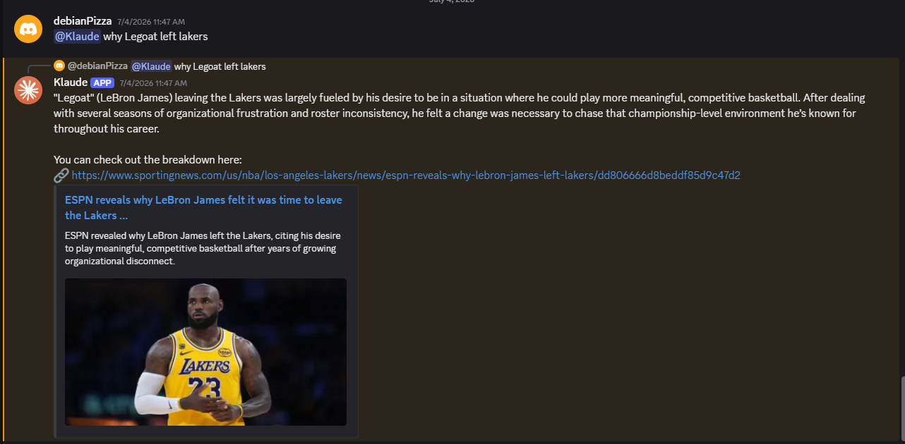

# Klaude (Rag-like Discord Bot)

A multi-module Discord bot built with Discord.js v14, featuring AI chat with RAG-typeshi-like, music playback, photo tracking, keyword triggers, and server utilities.

Hosted on **Render** (cloud). Active AI module uses **Upstash Redis** for conversation memory.

<table>
  <tr>
    <td width="50%">
      
      <p align="center"><b>Feature One View</b></p>
    </td>
    <td width="50%">
      
      <p align="center"><b>Feature Two View</b></p>
    </td>
  </tr>
</table>
---

## Features

| Module | Description |
|--------|-------------|
| **AI Bot (RAG-like)** | Conversational AI with per-user memory, real-time data via TMDB, RAWG, NewsAPI, and Tavily |
| **Music** | Play audio from Spotify, and SoundCloud in voice channels |
| **Photoloc** | Automatically tracks and stats image uploads per user/channel |
| **Moderator** | Responds to keywords with copypasta messages (toggleable per server) |
| **Extractor** | Server/user info utilities and data export commands |
| **Insomnia** | Periodic pings to keep the bot alive on free hosting |

---

## Prerequisites

- [Node.js](https://nodejs.org/) v22 LTS
- A Discord bot token ([Discord Developer Portal](https://discord.com/developers/applications))
- An [OpenRouter](https://openrouter.ai/) API key (for music module AI) <-- Optional
- A [Google AI](https://ai.google.dev/) API key (for RAG AI modules) <-- Better
- An [Upstash Redis](https://upstash.com/) account (for `f_rag_quality_v1` and `f_rag_efficient_v1` cloud memory)
- API keys for [TMDB](https://www.themoviedb.org/), [RAWG](https://rawg.io/apidocs), [NewsAPI](https://newsapi.org/), [Tavily](https://tavily.com/) (for RAG-like features)

---

## Installation

```bash
git clone https://github.com/laeffy7403/discord-bot-vscode-ver.git
cd discord-bot-vscode-ver
npm install
```

Create a `.env` file in the root directory:

```env
# Discord
DISCORD_BOT_TOKEN_1=your_main_bot_token (You need only discord bot token)
DISCORD_BOT_TOKEN_2=your_alt_bot_token_2 (Optional) 
DISCORD_BOT_TOKEN_3=your_alt_bot_token_3 (Optional)
DISCORD_BOT_TOKEN_4=your_alt_bot_token_4 (Optional)

# AI
OPENROUTER_API_KEY=your_openrouter_key (Optional)
GOOGLE_API_KEY=your_google_gemini_key (Better)

# RAG Data APIs
TMDB_KEY=your_tmdb_key
RAWG_KEY=your_rawg_key
NEWSAPI_KEY=your_newsapi_key
TAVILY_API_KEY=your_tavily_key

# Cloud DB (f_rag_quality_v1 only)
UPSTASH_REDIS_REST_URL=your_upstash_url
UPSTASH_REDIS_REST_TOKEN=your_upstash_token
```

Start the bot:

```bash
node launch.js
```

---

## Commands

### AI Commands
| Command | Description |
|---------|-------------|
| `@bot <message>` | Chat with the AI (has per-user memory) |
| `ai--clearmemo` | Clear your AI conversation history | 
| `ai--memostat` | View your conversation statistics |

### Music Commands
*(Must be in a voice channel)*

| Command | Description |
|---------|-------------|
| `-play <song/url>` | Play from YouTube, Spotify, or SoundCloud |
| `-skip` | Skip the current song |
| `-stop` | Stop and clear the queue |
| `-pause` | Pause playback |
| `-resume` | Resume playback |
| `-queue` | Show the current queue |
| `-nowplaying` | Show info about the current song |

### Photo Tracker Commands (Note: bot have to stay online 24/7)
| Command | Description |
|---------|-------------|
| `-mystat` | Your photo upload stats |
| `-photostat @user` | Stats for a specific user |
| `-toposter` | Leaderboard of top photo contributors |
| `-serverstat` | Overall server photo statistics |
| `-channelstat` | Photo stats for the current channel |

### Keyword Control Commands 
| Command | Description |
|---------|-------------|
| `-ton` | Enable keyword trigger responses |
| `-toff` | Disable keyword trigger responses |
| `-tstat` | Check current keyword toggle status |

### General
| Command | Description |
|---------|-------------|
| `--help` | List all available commands |
| `-uptime` | Show how long the bot has been online |

---

## Project Structure

```
├── launch.js                      # Entry point — loads all modules
├── debug.js                       # Standalone API connection tester
├── manual.js                      # Manual/utility helpers
├── package.json
├── .env                           # Secret tokens (not committed)
├── bot_modules/
│   ├── m_moderator.js             # Keyword trigger responses (copypastas)
│   ├── m_extractor.js             # Server/user info and data export
│   ├── m_music.js                 # Music playback (YT/Spotify/SoundCloud)
│   ├── m_photoloc.js              # Image upload tracking (local SQLite ⚠️)
│   └── m_insomnia.js              # Keep-alive pinger
├── bot_experimental/
│   ├── f_rag_efficient_v1.js      # ✅ ACTIVE — RAG AI, local SQLite memory
│   └── f_rag_quality_v1.js        # Alt RAG AI, Upstash Redis memory + rate limiting
├── additional_modules/
│   ├── a_insomnia_1.js            # Alt bot keep-alive (token 2)
│   ├── a_insomnia_2.js            # Alt bot keep-alive (token 3)
│   └── a_insomnia_3.js            # Alt bot keep-alive (token 4)
└── data/
    └── db/
        ├── conversations.db       # SQLite — AI chat memory (f_rag_efficient_v1)
        └── photos.db              # SQLite — photo upload stats (m_photoloc)
```

---

## Active Modules (launch.js)

Currently loaded in `launch.js`:

```
✅ m_moderator.js
✅ m_extractor.js
✅ m_music.js
✅ f_rag_efficient_v1.js   ← active AI module
❌ m_photoloc.js           (commented out)
❌ f_rag_quality_v1.js     (commented out)
❌ m_insomnia.js           (commented out)
❌ a_insomnia_*.js         (commented out)
```

---

## RAG Typeshi System Flow — `f_rag_quality_v1`

This module is the **quality-focused** RAG variant using **Upstash Redis** for cloud-based conversation memory and per-user rate limiting. It is only better on retriving game, news and film info rather other category like sport, weather, crypto money-shi CUZ i feel like it. Which boring fuck like to see sport and weather forecast when ur phone already has the built-in feature but still work like ass. As for crypto? i am not a crypto dude.

```
User @mentions bot
        │
        ▼
  Strip mention → extract userInput
        │
        ▼
  Rate Limit Check (Upstash Redis)
  rl:{userId} — max 10 req / 60s
        │
    Blocked? → reply with cooldown message
        │
        ▼
  Load Conversation History
  Upstash Redis: hist:{userId}
  (last 20 messages, TTL: 7 days)
        │
        ▼
  Fetch Channel Context
  Last 20 messages from Discord channel
        │
        ▼
  Intent Classification (Gemini)
  ┌─────────────────────────────┐
  │  movie / game / news / none │
  └─────────────────────────────┘
        │
   ┌────┴────┬──────────┬──────┐
   ▼         ▼          ▼      ▼
 movie      game       news   none
   │         │          │      │
 TMDB      RAWG      NewsAPI Tavily
   │         │          │      │
   └────┬────┴──────────┘      │
        ▼                      │
  Tavily Enrichment            │
  (always enriches in v1)      │
        │                      │
        └──────────┬───────────┘
                   ▼
         Build System Prompt
         (inject search results
          + channel context)
                   │
                   ▼
         Gemini Model Chain
         gemini-3.1-flash-lite →
         gemini-3-flash-live
         (fallback on 429)
                   │
                   ▼
         Save to Redis History
         hist:{userId} (lpush)
                   │
                   ▼
         Reply to Discord
         (chunked if > 2000 chars)
```

### Key differences vs `f_rag_efficient_v1`

| Feature | `f_rag_quality_v1` | `f_rag_efficient_v1` |
|---|---|---|
| Memory backend | Upstash Redis ☁️ | Upstash Redis ☁️ |
| Rate limiting | ✅ Redis-based | Redis-based |
| Channel context | ✅ Always fetched | ❌ Removed |
| Tavily enrichment | Always on | Conditional (sparse results only) |
| History limit | 20 messages | 15 messages |
| Token usage | Higher (quality) | Lower (optimized) |

---

## Database Summary

| Database | Module | Backend | Status |
|---|---|---|---|
| `hist:{userId}` | `f_rag_efficient_v1` | Upstash Redis ☁️ | ✅ Active |
| `rl:{userId}` | `f_rag_efficient_v1` | Upstash Redis ☁️ | ✅ Active |
| `photos.db` | `m_photoloc` | SQLite (local) | ✅ Active |
| `hist:{userId}` | `f_rag_quality_v1` | Upstash Redis ☁️ | ⚠️ Module inactive |
| `rl:{userId}` | `f_rag_quality_v1` | Upstash Redis ☁️ | ⚠️ Module inactive |

---

## Deployment

This bot is hosted on **Render** (cloud service).

- Entry point: `node launch.js`
- Port: `3001` (VS Code/Render version)
- Keep-alive: Express server on `/` responds with `"wes is running!"`

> The Replit version uses port `3000`. Do not mix the two. (not working anymore)

---

## Planned Changes

- [ ] Migrate `conversations.db` (SQLite) → Upstash Redis for cloud persistence
- [ ] Migrate `photos.db` (SQLite) → Upstash Redis or another cloud DB
- [ ] Unify all modules to use cloud DB so state persists across Render redeploys
- [ ] Switch deployment on other cloud platform from Render, if possible 

---

## Notes

- 'rag_location_v1' and a few archived ai module memory is currently stored in `conversations.db` (SQLite, local — resets on Render redeploy).
- Photo stats are stored in `photos.db` (SQLite, local — same caveat).
- `rag_quality_v1` and `rag_efficient_v1` uses Upstash Redis and survives redeploys, but is currently commented out in `launch.js`.

---

## License

ISC
